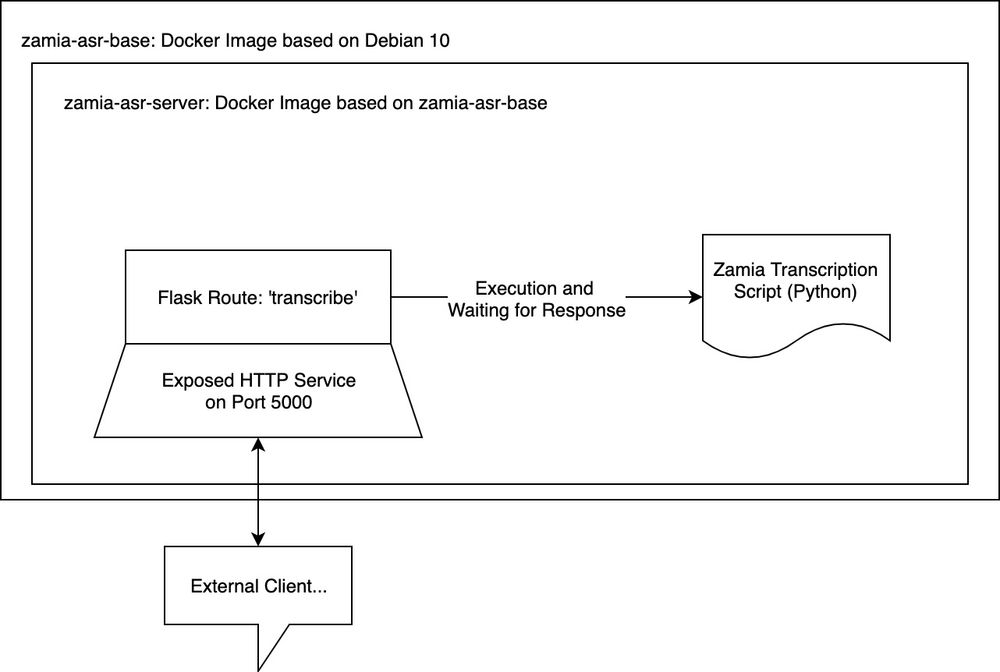

# zamia-asr-dockerization

## Basic Description

There are many open-source projects available to build an automatic speech recognition (asr) system. But with all of these libraries/systems, there comes a huge demand for in-depth knowledge to develop some asr on your own. Furthermore, there are hardware and data-set requirements which are not easy to fulfill.

Luckily [Zamia-ASR](http://zamia-speech.org/asr/) is one of the projects which attempts to provide already usable speech-models and instructions as well as demo scripts to use them. As of today, they published language models for English and German language which work well in noisy conditions and on different microphone recordings.

[Zamia](http://zamia-speech.org/asr/) is based on Kaldi, which is one of the most used solutions in the field of asr system development. This project makes use of the demonstration scripts and tries to abstract them as an easy-to-use REST-API.

### Abstraction Architecture as by now



### API Usage

## Building and Running the Docker Images

There are two docker images which build up the final API:

1. zamia-asr-base: This image builds up on Debian 10 and installs all requirements for zamia-scripts.
2. zamia-asr-server: This image uses the first one to run a [flask-based](https://flask.palletsprojects.com/en/1.1.x/) Python HTTP-Server which in turn calls the demonstration scripts with specific commands.

## Base Image

```docker build -t fabianbusch/zamia-asr-base:latest ./zamia-asr-base```

## Build and Run Flask Wrapper Image

```docker build -t fabianbusch/zamia-asr-server:latest . && docker run -it -p 80:5000 fabianbusch/zamia-asr-server:latest```